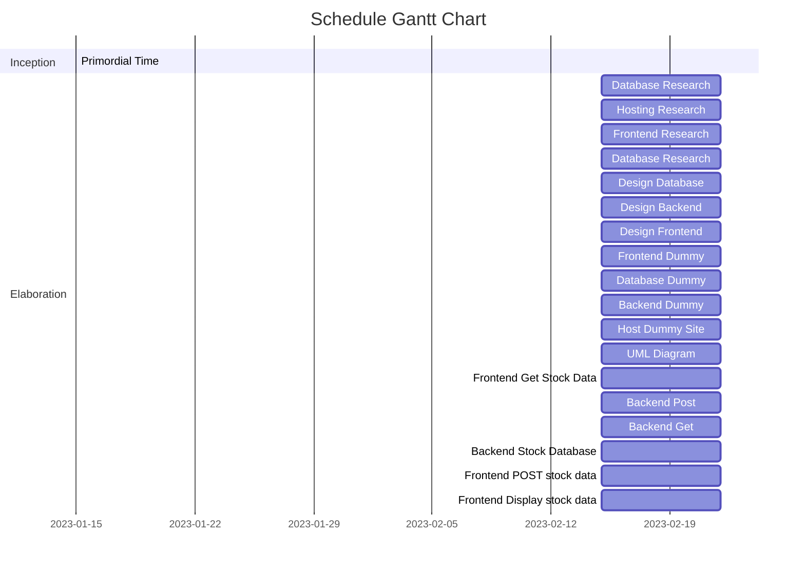

# Schedule

```mermaid
gantt
    title Schedule Gantt Chart
    dateFormat  YYYY-MM-DD
    excludes 2023-03-07 2023-03-08 2023-03-09 2023-03-10 2023-03-11 2023-03-12
    
        section Inception
        Primordial Time: done, 2023-01-15, 

        section Elaboration
         Database Research:  , 2023-02-15, 1w
        
         Hosting Research:  , 2023-02-15, 1w
        
         Frontend Research:  , 2023-02-15, 1w
        
         Database Research:  , 2023-02-15, 1w

         Design Database: , 2023-02-15, 1w

         Design Backend: , 2023-02-15, 1w

         Design Frontend: , 2023-02-15, 1w

         Frontend Dummy: , 2023-02-15, 1w

         Database Dummy: , 2023-02-15, 1w

         Backend Dummy: , 2023-02-15, 1w

         Host Dummy Site: , 2023-02-15, 1w

         UML Diagram: , 2023-02-15, 1w

         Frontend Get Stock Data: , 2023-02-15, 1w

         Backend Post : , 2023-02-15, 1w

         Backend Get: , 2023-02-15, 1w

         Backend Stock Database: , 2023-02-15, 1w

         Frontend POST stock data: , 2023-02-15, 1w

         Frontend Display stock data: , 2023-02-15, 1w

         section Implementation
         


        
```

