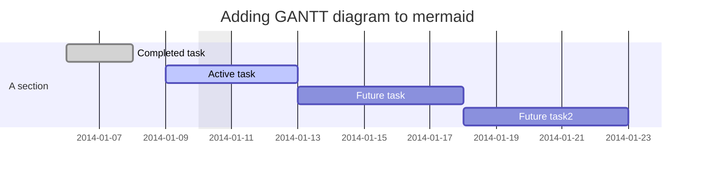

# Schedule

```mermaid
gantt
dateFormat  YYYY-MM-DD
title Adding GANTT diagram to mermaid
excludes weekdays 2014-01-10

section A section
Completed task            :done,    des1, 2014-01-06,2014-01-08
Active task               :active,  des2, 2014-01-09, 3d
Future task               :         des3, after des2, 5d
Future task2               :         des4, after des3, 5d
```

```mermaid
gantt
    title Schedule Gantt Chart
    dateFormat  YYYY-MM-DD
    excludes 2023-03-07 2023-03-08 2023-03-09 2023-03-10 2023-03-11 2023-03-12
    section Inception Phase 
         Introduction & Syllabus Lecture:  done, 2023-01-18, 1d
        section Inception Phase 
         Storyboard Lab:  done, 2023-01-20, 1d
        section Inception Phase 
         Elevator Pitch Lab:  done, 2023-01-23, 1d
        section Inception Phase 
         Individual Project Proposal Assignment: milestone, done, 2023-01-23, 1d
        section Inception Phase 
         Agile Project Management Lecture:  done, 2023-01-25, 1d
        section Inception Phase 
         Requirements Engineering  & System Overview Lab:  done, 2023-01-27, 1d
        section Inception Phase 
         Group Presentation Assignment: milestone, done, 2023-01-30, 1d
        section Elaboration Phase 
         Project Management Lecture:  done, 2023-02-01, 1d
        section Elaboration Phase 
         Group Meeting & Discussion Lab:  done, 2023-02-03, 1d
        section Elaboration Phase 
         Scheduling document and  Gantt Chart Lab:  done, 2023-02-06, 1d
        section Elaboration Phase 
         Requirements Document Assignment: milestone, done, 2023-02-08, 1d
        section Elaboration Phase 
         Rally Agile Web tool Lecture:  done, 2023-02-08, 1d
        section Elaboration Phase 
         Sprint Planning Meeting Lab:  done, 2023-02-10, 1d
        section Elaboration Phase 
         Software Development Plan Assignment: milestone, done, 2023-02-13, 1d
        section Elaboration Phase 
         Sprint 1: , 2023-02-13, 1w
        section Elaboration Phase 
         Software architecture design Lab:  done, 2023-02-13, 1d
        section Elaboration Phase 
         Project Backlog Lecture:  done, 2023-02-15, 1d
        section Elaboration Phase 
         Sprint Planning Meeting Lab:  , 2023-02-17, 1d
        section Elaboration Phase 
         Design Document Part 1 (Architecture) Assignment: milestone, , 2023-02-19, 1d
        section Elaboration Phase 
         Sprint 2: , 2023-02-20, 1w
        section Elaboration Phase 
         Interface Design Lab:  , 2023-02-20, 1d
        section Elaboration Phase 
         Features in milestone  demos Lecture:  , 2023-02-22, 1d
        section Elaboration Phase 
         Version Control/Sprint planning meeting Lab:  , 2023-02-24, 1d
        section Elaboration Phase 
         Design Document Part 2 (API) Assignment: milestone, , 2023-02-26, 1d
        section Elaboration Phase 
         Sprint 3: , 2023-02-27, 1w
        section Elaboration Phase 
         Software Quality Lab:  , 2023-02-27, 1d
        section Construction Phase 
         Defect Tracking Lecture:  , 2023-03-01, 1d
        section Construction Phase 
         Sprint Planning Meeting Lab:  , 2023-03-03, 1d
        section Construction Phase 
         Test Procedures Document Assignment: milestone, , 2023-03-05, 1d
        section Construction Phase 
         Spring Break (no classes held): done, 2023-03-06, 1d
        section Construction Phase 
         Sprint 4: , 2023-03-13, 1w
        section Construction Phase 
         Status Review Lecture:  , 2023-03-15, 1d
        section Construction Phase 
         Sprint Planning Meeting Lab:  , 2023-03-17, 1d
        section Construction Phase 
         Milestone Demo 1 :crit, milestone,  , 2023-03-20, 1d
        section Construction Phase 
         Sprint 5: , 2023-03-20, 1w
        section Construction Phase 
         Status Review Lecture:  , 2023-03-22, 1d
        section Construction Phase 
         Sprint Planning Meeting Lab:  , 2023-03-24, 1d
        section Construction Phase 
         Sprint 6: , 2023-03-27, 1w
        section Construction Phase 
         Status Review Lecture:  , 2023-03-29, 1d
        section Construction Phase 
         Sprint Planning Meeting Lab:  , 2023-03-31, 1d
        section Construction Phase 
         Milestone Demo 2 :crit, milestone,  , 2023-04-03, 1d
        section Construction Phase 
         Sprint 7: , 2023-04-03, 1w
        section Construction Phase 
         Status Review Lecture:  , 2023-04-05, 1d
        section Construction Phase 
         Sprint Planning Meeting Lab:  , 2023-04-07, 1d
        section Construction Phase 
         Sprint 8: , 2023-04-10, 1w
        section Construction Phase 
         Status Review Lecture:  , 2023-04-12, 1d
        section Construction Phase 
         Sprint Planning Meeting Lab:  , 2023-04-14, 1d
        section Construction Phase 
         Milestone Demo 3 :crit, milestone,  , 2023-04-17, 1d
        section Construction Phase 
         Sprint 9: , 2023-04-17, 1w
        section Construction Phase 
         Status Review Lecture:  , 2023-04-19, 1d
        section Construction Phase 
         Optimization Lab:  , 2023-04-21, 1d
        section Construction Phase 
         Sprint Planning Meeting Lab:  , 2023-04-21, 1d
        section Construction Phase 
         Test Report Document Assignment: milestone, , 2023-04-23, 1d
        section Construction Phase 
         Sprint 10: , 2023-04-24, 1w
        section Construction Phase 
         Final Presentation & Demo :crit, milestone,  , 2023-04-25, 1d
        section Construction Phase 
         Semester Review Lecture:  , 2023-04-26, 1d
        section Construction Phase 
         Final Software Release Assignment: milestone, , 2023-04-27, 1d
        section Construction Phase 
         Final Grade Submissions 🎓 :  , 2023-05-12, 1d
        
```

