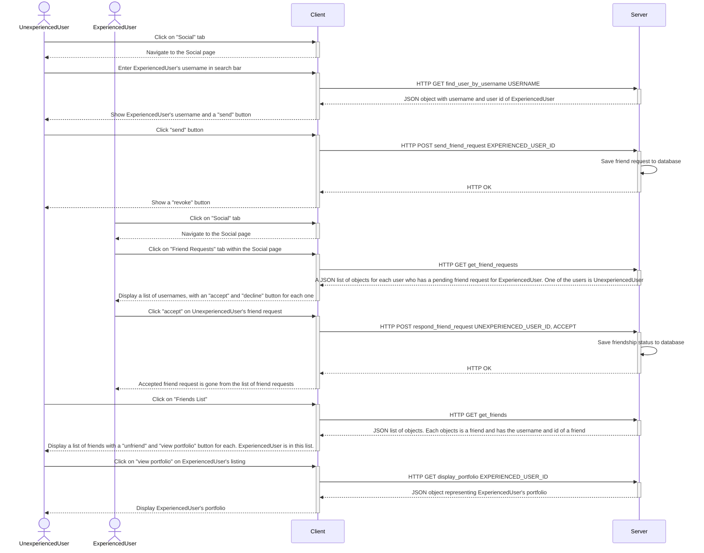

## Section 1 - Overview

The system is comprised of 4 different components: a client application in React, a server application in Django, two PostgreSQL databases, and a machine learning model for stock prediction that lives on Professor Wang's GPU server. The databases are accessed through an ORM. The user interacts with the client application, which makes API calls to the server. The server handles the calls, adding/deleting/modifying the database, or simply fetching data from the database. Our database is scheduled to be updated with new stock data daily. Our machine learning model is scheduled to run daily to make predictions for the next day for every stock in the S&P 500. Scheduling is done separately from our application using a Heroku scheduling tool.

## Section 2 - Components and Interfaces

This application will use four different components: client, server, database, and a machine learning model.

###### 2.1 Client

A React app. Upon logging in, the user has access to a graph that shows stock prices for the S&P 500 companies over the past month. The user can add fake funds to their account and use those funds to simulate the purchasing of stocks. Purchased stocks are added to the user's portfolio, which can be accessed through the website's navigation bar. The portfolio page displays the user's available funds (which are simulated), as well as a graph for each stock that the user "owns." Each graph will display the number of shares of a stock that the user owns, as well as the stock's close values for the last six days. The graph will also display a close price prediction for the next business day, to help guide the user's stock trading decisions. The website will also allow users to add friends to be able to view their portfolios. This also helps the user in their stock trading decisions, as they can follow in the footsteps of a mentor who has experience in the stock market.

###### 2.2 Server

A Django application. This component accesses stock data from our database and sends it to the client. This allows the client to display stock data of the S&P 500 companies. The server also handles user authentication and account registration. It receives and processes requests to add/sell stocks to/from the user's portfolio. It processes the sending, receiving, and responding of friend requests. It also allows users to search for other users to add them as friends. The interface to the server is through HTTP requests coming from the client.

###### 2.3 Database

Two PostgreSQL databases. One database is used to hold user, friendship, friend request, and portfolio data. The other database is used to hold large amounts of historical stock data, and next-day stock prediction data produced by the machine learning model. The interface for this component is through an ORM that translates python to SQL queries. These queries come from the server.

###### 2.4 Machine Learning Model

A machine learning model that predicts the next day's close value for each of the stocks in the S&P 500. This model lives on Professor Wang's GPU server, and is set to run daily after the stock market closes. 

## Algorithms

This application will utilize machine learning to make decisions on which stock to purchase. Stocks will be analyzed as discrete time data, and whether or not to purchase a stock will be determined by the stock's price, market cap, historical returns, volume of historical trades, alpha (excess return), beta (volatility) and any other quantitative data. This means we will be using technical anaylsis for our algorithms, which is best used in more short term trades. Essentially, the behavior of stock prices will be treated as a regression problem. In particular, there will be three trading strategies employed:

1. S&P 500: Evaluate each stock comprising the S&P 500, determine its growth potential and sort each company in order of predicted growth. Then, if fractional shares are allowed, divide the user's capital and invest in each stock in proportion to its growth potential, i.e. if Apple is projected to be three times more likely to grow than Tesla, invest three times more money into Apple than Tesla. If fractional shaes are not allowed, then find every permutation of stocks that may be purchased from this list and chose the overall most profitable one.
2. Long Term: Analyze the stock market and flag certain stocks for growth, investing a specified percentage of the user's capital into each flagged stock. Then, once the stock is determined to no longer be growing, sell the stock.
3. Day Trading: Analyzing the stock market, find stocks that are currently growing and then immediately sell once the begin decreasing. This will be done at a high frequency.

The success of these algorithms will be determined by how they perform in comparison to the S&P 500, root mean squared error, and mean absolute percent error.

## Section 4 - Class Diagrams

### 4.1 Client Diagram


#### App

*loggedIn*: A boolean value indicating if user is logged in

*Nav()*: The navigation bar

*HomePage()*: A welcome page that the user lands on upon visiting the page.

#### Login

*username*: State variable holding the current text in the username input field.

*password*: State variable holding the current text in the password input field.

*feedback*: State variable holding the current feedback. Feedback is used to display messages (error or otherwise) to the user.

*onLogin()*: Called when the user clicks the login button or hits enter after typing a password. This function makes an API call to authenticate the user. On success, the user is navigated to the home page. Otherwise, an error message is displayed

#### Register

*username*: State variable holding the current text in the username input field.

*password*: State variable holding the current text in the password input field.

*passwordConf*: State variable holding the current text in the password confirmation input field.

*feedback*: State variable holding the current feedback. Feedback is used to display messages (error or otherwise) to the user.

*onRegister()*: Called when the user clicks the register button or hits enter after typing the password confirmation. This function makes an API call to try to register the user. On success, a message is displayed indicating that an account was created. Otherwise, an error message is displayed.

#### Portfolio

*username*: The username of the user who owns the portfolio. Passed through props.

*isSelf*: An indication if this portfolio belongs to the user who is viewing it. If this value is true, a sell button is displayed next to each stock in the user's portfolio. Passed through props.

*userId*: The user id of the user who owns the portfolio. Used to query the backend for the portfolio data. Passed through props.

*sellStock(String stock, Number qty, Number price)*: Takes in the stock's ticker, the number of shares of said stock to sell, and the price of the stock. It makes an API call to sell the stock and sends an alert to the user that the stock was sold.

*genData(String name, Array data)*: Takes in the name (ticker) of a stock and an array containing objects that each contain a close price and the date of that close price. Generates a random color for the graph and returns the parameters in a way that is expected by the Apex Charts library.

*loadPortfolio(Number id)*: Makes an API call to get the portfolio of the user with the supplied id.

#### Candle

*currentStockAmount*: The amount of shares to purchase from the currently selected stock.

*getDefaultDisplay()*: Shows stock data for a random company. Called upon landing on the candle page.

*updatePortfolio()*: "Purchase" a share (or multiple, depending on ) of the selected stock and add it to the user's portfolio.

*updateAmount()*: Update currentStockAmount based on changes to the input field.

*updateChart(String ticker, String name)*: Makes the chart display stock data of the company with the supplied ticker. The name parameter is the company's name joined with the ticker joined with the sector that the company is in. The name parameter is displayed as the chart's title.

#### Simulation

*investment*: State variable representing the user's current available funds for investment.

*setAndFetchInvestment(Number value)*: Makes an API call to set the supplied value as the user's investment. Updates the investment value on screen if the API call was successful.

#### Search

*username*: State variable holding the current text in the username input field.

*foundUser*: Object that holds information about the last searched user.

The object looks like this:

```
{
  username: String
  user_id: Number
  is_friend: Boolean
  incoming_request: Boolean
  outgoing_request: Boolean
}
```

This data is needed to determine what the search pages looks like as well as what actions can be made from the search page. If the searched user is a friend, the page displays a tag that shows friendship status. If the user has an incoming friend request from the searched user, no action can be taken from the search page. If the user has an outgoing friend request to the searched user, the user can revoke that friend request. Finally, if the searched user is not a friend, the user can send them a friend request.

*sendRequest()*: Make an API call to send a friend request to the current found user.

*revokeRequest()*: Make an API call to revoke a friend request that was previously sent to the current found user.

*findUser()*: Make an API call to search for a user whose username matches the current value of `username`

#### Friends

*friends*: State variable holding a list of the user's friends.

*onUnfriend(i, userId)*: Takes in the index of the friend to unfriend and their user id. Calls an API function to unfriend the user with the supplied user id.

#### FriendRequests

*requests*: State variable holding a list of users who have an outgoing friend request for the user.

*respondRequest(i, userId, isAccept)*: Respond to the friend request coming from the user with the supplied user id. If isAccept is true, a friendship is established between the user and the sender of the friend request. In both cases, the friend request is deleted. `i` is used to remove the request from `requests`.

### 4.2 Server Diagram


Each component in the diagram above is a Django view. A Django view is an API function.


Each component in the diagram above is a Django view. A Django view is an API function.
These views make up the application's social functionality.

### 4.3 Entity Relationship Diagram


The User entity represents a user of the application. It contains basic information on the user, with their username as the primary key. User has direct relationships with the Portfolio entity. A user can place an order (buying stock.) When a stock is ordered, it is placed in a user's portfolio, which is a collection of stocks the user currently has stake in (sold stocks are not included.) The Portfolio entity has a primary key portfolio_id and foreign key username, linking the portfolio to the user it belongs to. The stock table represents a specific stock, and contains a primary key stock_symbol and various metrics used to determine the stock's value. The Portfolio and Stock entities have a many-to-many relationship, thus they have a junction table Portfolio_Stock. This contains foreign keys portfolio_id and stock_symbol. These foreign keys act together to uniquely identify an entry in the junction table. The Backlog entity holds stock data for every stock in the S&P 500 index. It is automatically updated daily with the most recent stock data. The Model_Prediction entity holds predicted close prices that are outputted by our machine learning model.

## Section 5 - Sequence Diagrams

### 5.1

User wants to keep track of stock data in order to make profitable trades.


<br/>
1. The user enters their username and password and logs in.
2. The client makes an API call to get a JWT token pair (access and refresh tokens).
3. The server returns a JWT token pair.
4. The client saves the token pair in local storage for later use.
5. The client routes to the home page, which has a "View Dashboard" button.
6. The user clicks on the "View Dashboard" button.
7. The client routes to the stock graph page.
8. The client makes an API call to get historical stock data for a random company.
9. A JSON object is returned with all the historical data.
10. The user selects Amazon stock from the dropdown.
11. The client makes an API call to get Amazon's historical stock data
12. The server returns a JSON object representing Amazon's historical stock data.
13. The client displays the data on the graph.
    
### 5.2

User is a student who is unexperienced in the stock market, looking to get started with the guidance of a friend. They use the app's social feature to learn portfolio building tips from their friend.


<br/>
1. UnexperiencedUser is assumed to be logged in. They click on the "Social" tab.
2. The website navigates to the the Social page, which has a search feature for users.
3. UnexperiencedUser enters ExperiencedUser's username in the search bar.
4. The website makes an API call to the backend, looking for a user that matches the entered username.
5. The backend returns an object representing ExperiencedUser. It has their username and user id.
6. The website displays the username of ExperiencedUser along with a "send" button next to the name.
7. UnexperiencedUser clicks the "send" button to send a friend request to ExperiencedUser.
8. The website makes an API call to the backend.
9. The backend saves the friend request in the database.
10. The website shows a "revoke" button, in case the user changes their mind about the friend request.
11. ExperiencedUser is assumed to be logged in. They click on the "Social" tab.
12. The website navigates to the the Social page.
13. ExperiencedUser clicks on the "Friend Requests" tab.
14. The website makes an API call to the backend.
15. The backend sends a JSON list of friend requests that are sent to ExperiencedUser.
16. The website displays the list of friend requests, along with "accept" and "decline" buttons.
17. ExperiencedUser clicks "accept" on UnexperiencedUser's friend request.
18. The website makes an API call to accept the friend request.
19. The backend handles the API call, saving the friendship status to the database, and deleting the friend request from the database.
20. The backend returns a success status code: HTTP 200 OK
21. The website now re-renders the friend requests list. The accepted friend request is gone from the list.
22. UnexperiencedUser clicks on the "Friends List" tab in Social.
23. The website makes an API call to the server to get the list of friends.
24. The backend returns the list of friends in JSON format. ExperiencedUser is in this list.
25. The website displays a list of friends, with "unfriend" and "view portfolio" buttons.
26. UnexperiencedUser clicks on "view portfolio" on ExperiencedUser's listing.
27. The website makes an API call to get ExperiencedUser's portfolio.
28. The backend returns the portfolio in JSON format.
29. The website renders the graphs for ExperiencedUser's portfolio.
30. UnexperiencedUser observes ExperiencedUser's stock investment choices and learns from them.
31. UnexperiencedUser has a better idea of how to invest in stocks.
